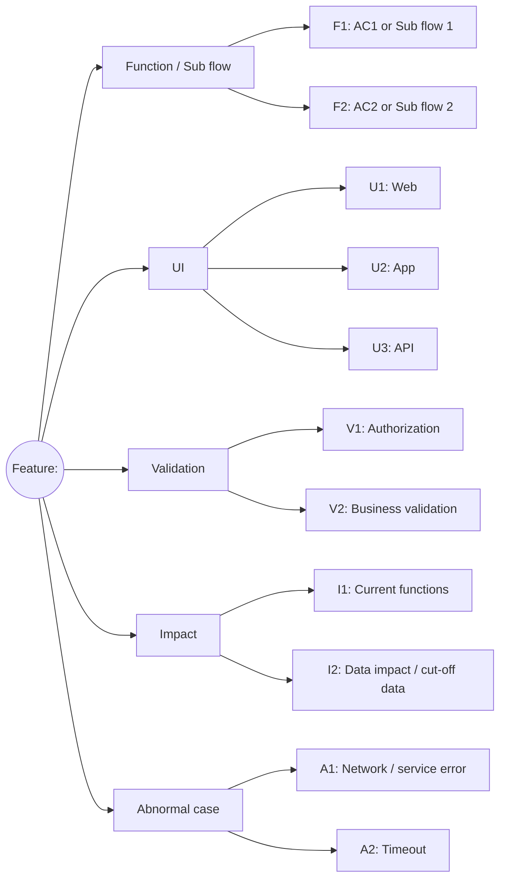
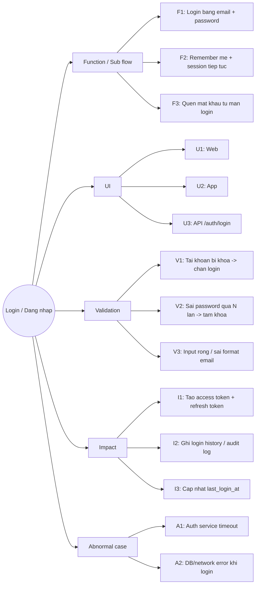

# Test Design HLTC Template (High-Level, Optional)

Dung template nay cho Skill 01.2 de review nhanh scope test truoc khi viet TC chi tiet.
Markdown outline la dinh dang mac dinh. Mermaid/so do chi la tuy chon khi can review truc quan.

## Dinh dang luu tru va chuyen doi

| Muc dich | Dinh dang | Cach dung | Bao mat |
|---|---|---|---|
| Xem + sua trong VS Code (khuyen nghi) | Markmap Markdown | Cai extension "Markmap" (gera2ld) -> render live ngay trong editor, sua file la cap nhat | Local |
| Luu trong file .md / GitHub | Mermaid `graph LR` | Render trong VS Code (Mermaid Preview ext) / GitHub / Notion | Local |
| Import vao XMind (offline) | Tab-indent outline | File > Import > Text Outline | Local |
| Phuong an du phong (khong co sensitive data) | Markmap Markdown | markmap.js.org/repl -> client-side, khong upload server | Khong dung cho noi dung noi bo |

> Mermaid `mindmap` khong dung lam dinh dang chinh, kho doc.

**Cai Markmap cho VS Code (1 lan duy nhat):**
1. Extensions (`Ctrl+Shift+X`) -> tim **"Markmap"** publisher: `gera2ld` -> Install
2. Mo file `.md` -> bam icon Markmap tren toolbar hoac `Ctrl+Shift+P` -> `Markmap: Open as Markmap`
3. Panel ben canh hien mindmap live -> sua file la tu dong cap nhat

## Markdown Outline (dinh dang mac dinh)

```markdown
# Feature: <ten feature>

## Function / Sub flow
- F1: AC1 or Sub flow 1
- F2: AC2 or Sub flow 2

## UI
- U1: Web
- U2: App
- U3: API

## Validation
- V1: Authorization
- V2: Business validation

## Impact
- I1: Current functions
- I2: Data impact / cut-off data

## Abnormal case
- A1: Network / service error
- A2: Timeout
```

## Markmap Markdown - tuy chon neu can so do

```markdown
# Feature: <ten feature>

## Function / Sub flow
- F1: AC1 or Sub flow 1
- F2: AC2 or Sub flow 2

## UI
- U1: Web
- U2: App
- U3: API

## Validation
- V1: Authorization
- V2: Business validation

## Impact
- I1: Current functions
- I2: Data impact / cut-off data

## Abnormal case
- A1: Network / service error
- A2: Timeout
```

Huong dan:
1. Vao **markmap.js.org/repl**
2. Xoa noi dung mau ben trai, paste markdown vao
3. Mindmap hien ra ben phai ngay lap tuc
4. Bam **Download SVG** hoac **Download HTML** de luu

## Mermaid Graph LR (dinh dang luu trong .md)



## Tab-indent outline - import vao XMind / MindMeister / Coggle

```text
Feature: <ten feature>
	Function / Sub flow
		F1: AC1 or Sub flow 1
		F2: AC2 or Sub flow 2
	UI
		U1: Web
		U2: App
		U3: API
	Validation
		V1: Authorization
		V2: Business validation
	Impact
		I1: Current functions
		I2: Data impact / cut-off data
	Abnormal case
		A1: Network / service error
		A2: Timeout
```

## Review Gate Checklist

Dung chinh xac 9 muc nay (theo Skill 01.2), khong tu them/bot:

- [ ] Da cover du cac nhanh Function/Sub flow chinh
- [ ] Da cover UI dung kenh can ap dung (Web/App/API)
- [ ] Da cover Validation: authorization + business rule quan trong
- [ ] Da cover Impact: current functions va data impact
- [ ] Da cover Abnormal case: timeout va network/system error
- [ ] Da cover it nhat 1 negative branch moi rule quan trong
- [ ] Da xac dinh ro branch can vao Smoke
- [ ] Khong co mau thuan ro rang voi AC/BR
- [ ] Team da review va chot "Approved" scope high-level

Ket qua gate: PASS / FAIL

## Vi du - Chuc nang Dang nhap

```markdown
# Login / Dang nhap

## Function / Sub flow
- F1: Login bang email + password
- F2: Remember me + session tiep tuc
- F3: Quen mat khau tu man login

## UI
- U1: Web
- U2: App
- U3: API /auth/login

## Validation
- V1: Tai khoan bi khoa -> chan login
- V2: Sai password qua N lan -> tam khoa
- V3: Input rong / sai format email

## Impact
- I1: Tao access token + refresh token
- I2: Ghi login history / audit log
- I3: Cap nhat last_login_at

## Abnormal case
- A1: Auth service timeout
- A2: DB/network error khi login
```



### Review Gate - Login

- [x] Da cover du cac nhanh Function/Sub flow chinh
- [x] Da cover UI dung kenh can ap dung (Web/App/API)
- [x] Da cover Validation: authorization + business rule quan trong
- [x] Da cover Impact: current functions va data impact
- [x] Da cover Abnormal case: timeout va network/system error
- [x] Da cover it nhat 1 negative branch moi rule quan trong
- [x] Da xac dinh ro branch can vao Smoke
- [x] Khong co mau thuan ro rang voi AC/BR
- [x] Team da review va chot "Approved" scope high-level

Ket qua gate: PASS
